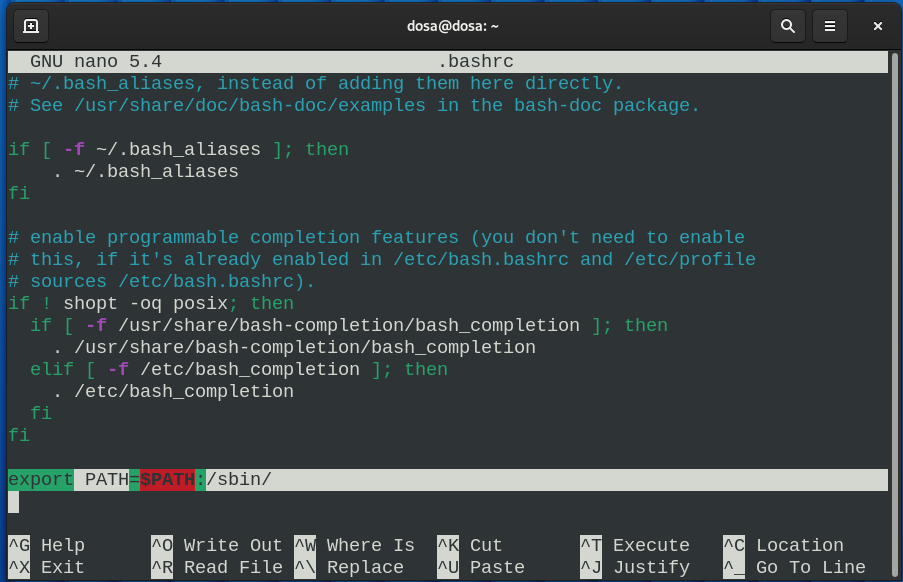

## 01: Troubleshooting "ifconfig command not found"

### Error:
```shell
dosa@dosa:~$ ifconfig
bash: ifconfig: command not found
```

### Fix:
The `ifconfig` command has been deprecated and thus missing by default on Debian Linux.

Installing the [net tools](https://www.linux.co.cr/ldp/lfs/appendixa/net-tools.html) package.
The net-tools package is a toolkit that ships a spectrum of programs which form the base of Linux networking. These include:
- ifconfig
- netstat
- dig
- hostname
- route
- arp
- iptunnel

```shell
dosa@dosa:~$ sudo apt-get install net-tools
```

Once the installation is complete and successful, try running `ifconfig` command again.
```shell
dosa@dosa:~$ ifconfig
bash: ifconfig: command not found
dosa@dosa:~$ /sbin/ifconfig
enp0s3: flags=4163<UP,BROADCAST,RUNNING,MULTICAST>  mtu 1500
        inet 10.0.2.15  netmask 255.255.255.0  broadcast 10.0.2.255
        inet6 fe80::a00:27ff:fee0:9397  prefixlen 64  scopeid 0x20<link>
        ether 08:00:27:e0:93:97  txqueuelen 1000  (Ethernet)
        RX packets 859  bytes 1102186 (1.0 MiB)
        RX errors 0  dropped 0  overruns 0  frame 0
        TX packets 418  bytes 33703 (32.9 KiB)
        TX errors 0  dropped 0 overruns 0  carrier 0  collisions 0

lo: flags=73<UP,LOOPBACK,RUNNING>  mtu 65536
        inet 127.0.0.1  netmask 255.0.0.0
        inet6 ::1  prefixlen 128  scopeid 0x10<host>
        loop  txqueuelen 1000  (Local Loopback)
        RX packets 50  bytes 4457 (4.3 KiB)
        RX errors 0  dropped 0  overruns 0  frame 0
        TX packets 50  bytes 4457 (4.3 KiB)
        TX errors 0  dropped 0 overruns 0  carrier 0  collisions 0
```
`ifconfig` command works, but we need to specify the `/sbin` directory for it. Because ifconfig is located in `/sbin` and `/sbin` is not added to the PATH.


Adding `/sbin` to PATH.
```shell
dosa@dosa:~$ export PATH=$PATH:/sbin/
dosa@dosa:~$ ifconfig
enp0s3: flags=4163<UP,BROADCAST,RUNNING,MULTICAST>  mtu 1500
        inet 10.0.2.15  netmask 255.255.255.0  broadcast 10.0.2.255
        inet6 fe80::a00:27ff:fee0:9397  prefixlen 64  scopeid 0x20<link>
        ether 08:00:27:e0:93:97  txqueuelen 1000  (Ethernet)
        RX packets 859  bytes 1102186 (1.0 MiB)
        RX errors 0  dropped 0  overruns 0  frame 0
        TX packets 419  bytes 33765 (32.9 KiB)
        TX errors 0  dropped 0 overruns 0  carrier 0  collisions 0

lo: flags=73<UP,LOOPBACK,RUNNING>  mtu 65536
        inet 127.0.0.1  netmask 255.0.0.0
        inet6 ::1  prefixlen 128  scopeid 0x10<host>
        loop  txqueuelen 1000  (Local Loopback)
        RX packets 50  bytes 4457 (4.3 KiB)
        RX errors 0  dropped 0  overruns 0  frame 0
        TX packets 50  bytes 4457 (4.3 KiB)
        TX errors 0  dropped 0 overruns 0  carrier 0  collisions 0
```

This works, however each time we exit the terminal and start a new terminal instance, this path is lost, and we need to run the export command again.

How can we do it so this will be set permanently?
```shell
dosa@dosa:~$ sudo nano .bashrc
```



```shell
dosa@dosa:~$ source ~/.bashrc
dosa@dosa:~$ ifconfig
enp0s3: flags=4163<UP,BROADCAST,RUNNING,MULTICAST>  mtu 1500
        inet 10.0.2.15  netmask 255.255.255.0  broadcast 10.0.2.255
        inet6 fe80::a00:27ff:fee0:9397  prefixlen 64  scopeid 0x20<link>
        ether 08:00:27:e0:93:97  txqueuelen 1000  (Ethernet)
        RX packets 859  bytes 1102186 (1.0 MiB)
        RX errors 0  dropped 0  overruns 0  frame 0
        TX packets 420  bytes 33827 (33.0 KiB)
        TX errors 0  dropped 0 overruns 0  carrier 0  collisions 0

lo: flags=73<UP,LOOPBACK,RUNNING>  mtu 65536
        inet 127.0.0.1  netmask 255.0.0.0
        inet6 ::1  prefixlen 128  scopeid 0x10<host>
        loop  txqueuelen 1000  (Local Loopback)
        RX packets 50  bytes 4457 (4.3 KiB)
        RX errors 0  dropped 0  overruns 0  frame 0
        TX packets 50  bytes 4457 (4.3 KiB)
```
