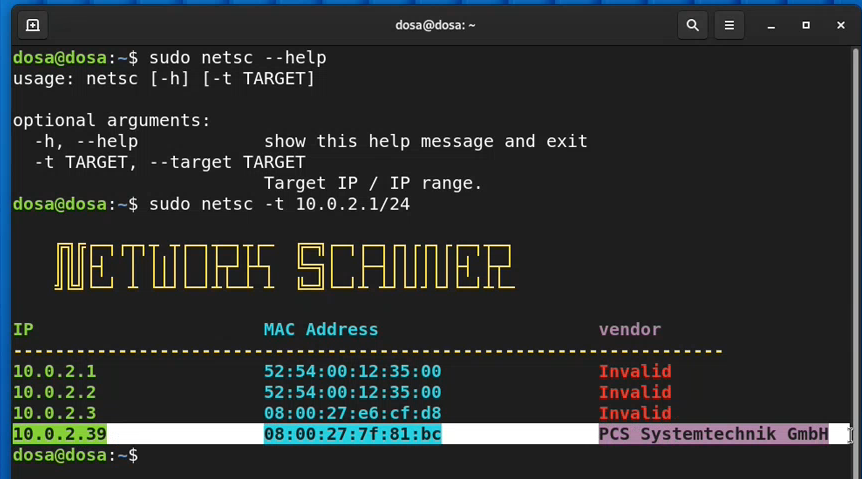
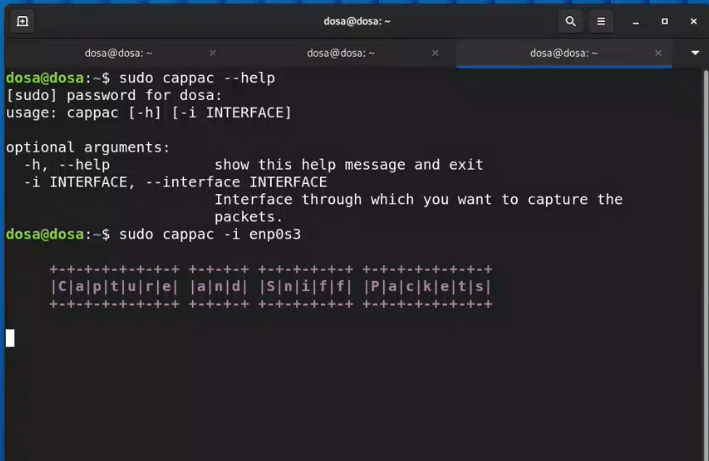
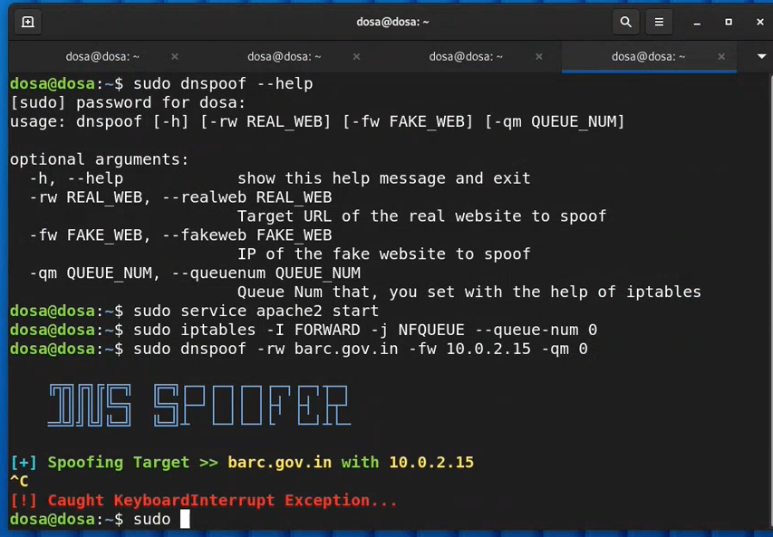
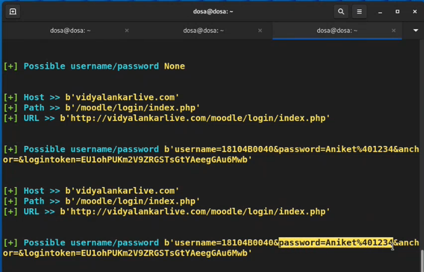
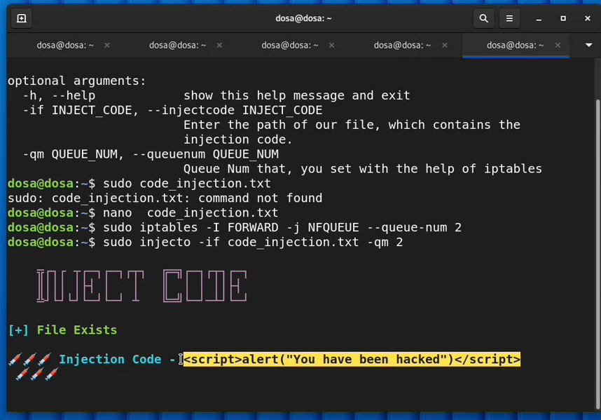

# BACHELOR OF ENGINEERING PROJECT ON
## NETWORK SECURITY ASSESSMENT & PENETRATION TESTING VIRTUAL MACHINE

### Submitted By
- [Aniket .A](https://github.com/aniketambore/)
- [Dhanesh .K](https://github.com/DhaneshKawad/)
- [Omkar .K](https://github.com/OmkarKhedekar/)
- [Shubham .N](https://github.com/shunax19/)

SYNOPSIS REPORT SUBMITTED IN PARTIAL FULFILLMENT OF THE REQUIREMENT FOR THE DEGREE OF BACHELOR OF ENGINEERING IN ELECTRONICS & TELECOMMUNICATION

### UNDER THE GUIDANCE OF
Prof. Atul Oak

* * *

Department of Electronics & Telecommunication Engineering

Vidyalankar Institute of Technology
Wadala (E) Mumbai 400 037.

## Declaration

We declare that this written submission represents our ideas in our own words and where others' ideas or words have been included, we have adequately cited and referenced the original sources. We also declare that we have adhered to all principles of academic honesty and integrity and have not misrepresented or fabricated or falsified any idea/data/fact/source in our submission. We understand that any violation of the above will be cause for disciplinary action by the Institute and can also evoke penal action from the sources which have thus not been properly cited or from whom proper permission has not been taken when needed.

## Abstract
The security risks for organizations, companies that work with sensitive, critical data are very evident. There is always concern about the safety of the data and the applications where that data is used. In many situations, organizations are not aware of the vulnerabilities in their security protocols. That’s where Penetration Testing comes into the picture. Penetration Testing is a process of attacking a system/network through various ways to point out the vulnerabilities/breach points in the system.

The stages in a penetration testing cycle consist of data gathering of the target system, scanning the target system to identify the available services/protocols, identifying existing systems and applications that are running on the target system, and identifying and exploiting the known vulnerabilities on the systems and applications.

By undertaking these steps, we can find the vulnerable points in the system and make sure that attackers cannot exploit these weaknesses.

# Table of Contents
1. [Introduction](#1-introduction)
2. [Objective of Project](#2-objective-of-project)
3. [Literature Survey](#3-literature-survey)
   - [3.1 What is Penetration Testing?](#31-what-is-penetration-testing)
   - [3.2 Why Perform a Penetration Test?](#32-why-perform-a-penetration-test)
   - [3.3 What is already available in the Market?](#33-what-is-already-available-in-the-market)
   - [3.4 What is different in our alternative?](#34-what-is-different-in-our-alternative)
4. [Problem Statement](#4-problem-statement)
5. [Scope of the Project](#5-scope-of-the-project)
   - [5.1 Project requirements](#51-project-requirements)
   - [5.2 Objectives and Goals](#52-objectives-and-goals)
6. [Proposed System](#6-proposed-system)
7. [Methodology](#7-methodology)
   - [7.1 SAMPLES / MATERIALS](#71-samples--materials)
   - [7.2 RESEARCH TOOLS & PROCEDURES](#72-research-tools--procedures)
   - [7.3 DATA ANALYSIS TECHNIQUES](#73-data-analysis-techniques)
8. [Analysis](#8-analysis)
   - [8.1 Development Cost](#81-development-cost-)
   - [8.2 Set-up](#82-set-up-)
9. [Designing](#9-designing)
   - [9.1 Sequential Diagram](#91-sequential-diagram)
10. [Hardware & Software requirement](#10-hardware--software-requirements)
   - [Hardware Requirements](#hardware-requirements--minimum-requirements-to-run-the-operating-system-and-virtual-machine)
   - [Software Requirements](#software-requirements-)
11. [Timeline Chart of project implementation](#11-timeline-chart-of-project-implementation)
   - [11.1 Timeline](#111-timeline)
12. [References](#12-references)

## 1. Introduction
This project is designed for network penetration testing and vulnerability assessment. We have focused on setting up various attack scenarios by developing a variety of tools that can be used to exploit a network’s weakness. We aim to create an operating system based on Debian specifically for penetration testing.

There are other alternatives available in the market, namely Kali Linux, BlackArch, Parrot Security, etc. but we have tried to build an operating system that only has the most important scripts, unlike the readily available solutions. The target is to make a stripped-down, lightweight, yet powerful network penetration testing OS.

Since there are also OS’s in the market built specifically for this purpose, the main focus is to resolve how we can introduce a better alternative to the pre-existing ones. In this scenario, since Debian is lacking any kind of pen-testing tools, we are trying to make a customized Debian-based one, henceforth called the “DOSA OS”. We undertook this project to build a better and user-friendly solution for pen-testing.

The type of penetration testing we are opting for is White Hat testing, which means that the user will have full information and permission of the system admin to attack the system for testing. This can also be termed ethical hacking.

## 2. Objective of Project
As a network penetration testing VM(Virtual Machine), we plan to identify the weaknesses in the network or the device using custom scripts that we have developed.

Security shouldn’t be taken lightly as we live in the modern era where a person’s identity can be stolen and sold. We plan to make a VM that will be able to detect vulnerabilities in the system using the custom scripts which our team developed. The scripts can find and detect the devices connected to the victim, also being able to monitor their activities or modify a couple of aspects of it.

## 3. Literature Survey
### 3.1 What is Penetration Testing?
Penetration testing, also called “pen testing” or “ethical hacking” is the practice of testing a computer system, network, or web application to find security vulnerabilities that an attacker could exploit. Penetration testing can be automated with software applications or performed manually. Either way, the process involves gathering information about the target before the test, identifying possible entry points, attempting to break in either virtually or for real, and reporting back the findings.

### 3.2 Why Perform a Penetration Test?
If a vulnerability is utilized by an unauthorized individual to access company resources, company resources can be compromised. The objective of a penetration test is to address vulnerabilities before they can be utilized.

### 3.3 What is already available in the Market?
- [Nmap](https://nmap.org/) (Port scanner)
- [Metasploit](https://www.metasploit.com/) (Web vulnerability scanner)
- [Nikto](https://cirt.net/Nikto2) (Web vulnerability scanner)
- [OpenVAS](http://sectools.org/tool/openvas/) (Vulnerability scanner)
- [Kismet](https://www.kismetwireless.net/) (Packet sniffer)
- [Kali Linux](https://www.kali.org/) (The Most Advanced Penetration Testing Distribution)

### 3.4 What is different in our alternative?
We are using our custom-built OS called “DosaOS” which is based on the latest DEBIAN distribution (version 11). The purpose of this OS is to penetrate the networks and find vulnerabilities in the victim machines. Initially, the template DEBIAN distribution that we have used does not contain any penetration testing toolkit at all. This means that it has to be implemented into this template right from the scratch! The following are the set of scripts written in PYTHON that will do the aforementioned work:

### Network Scanner [netsc]:
- “netsc” is a Python package that can be used to scan a network - get mac addresses and IP of connected devices

### ARP Spoofer [arpspoof]:
- “_arpspoof_” is a DEB package that can be used to become the man in the middle and transfer packets through it!

### Packet Sniffer [cappac]:
- “_cappac_” is a DEB package that can be used to Capture & Sniff Packets - Sniffs Packets, Captures Data Files while Accessing Websites, Captures Passwords & Usernames (Login Data)!

### DNS Spoofer [dnspoof]:
- “_dnspoof_” is a DEB package that can be used to Intercept and Modify network traffic.

### Code Injector [injecto]:
- “_injecto_” is a DEB package that can be used to Inject Code on websites.

### Replace Downloads [repdwn]:
- “repdwn” is a DEB package that can be used to Intercept and Replace files.

### MAC Changer [macc]:
- “_macc_” is a DEB package that can be used to Change MAC Addresses - Increase anonymity, Impersonate other devices, Bypass filters!

## 4. Problem Statement
Creating a specialized VM(_Virtual Machine_) specifically to bring together the most effective Network Security Assessment and Penetration Testing tools and customized scripts.

It enables Network Penetration testers, a quick way to get started and have access to the tools and scripts required specifically for network penetration testing, all neatly packaged under one roof.

## 5. Scope of the Project
### 5.1 Project requirements:
- Identifying the relevant tools required for penetration testing.
- A suitable environment to develop and test the scripts. (Virtual Machine, Python)
- A platform for collaboration of individual work on the project. (GitHub)
- Gather relevant resources for reference. (Courses, Research papers)

### 5.2 Objectives and Goals:
- Setting up a Debian-based operating system on Virtual Machine.
- Setting up a test machine. (Windows-based)
- Developing the relevant scripts as per our requirements.
- To obtain an operating system that has the penetration testing tools installed, devoid of its bloatware.

## 6. Proposed System
As the network penetration VM our end goal is to achieve a custom Linux operating system based on Debian distro which will have a customized boot loader and will not use many resources while running background.

Our scripts are meant to isolate and monitor the victims browsing while keeping track of the keys pressed and ultimately becoming the man in the middle. Depending on how the attacker decides to use the data it can be taken note of and secured or can be exploited. By intercepting packets data can be redirected to some dummy sites for extracting data from users where the attacker has full control over the activities of the victim also the packets are modified by the attacker before sending it over the internet.

## 7. Methodology
### 7.1 SAMPLES / MATERIALS:
- A capable working 64-bit PC/Laptop (with at least 8GB RAM and 100GB free storage) for launching VirtualBox.
- The latest build of Debian Linux Distribution (version 11).
- VirtualBox software for hosting virtual machines.
- Bleachbit for obliterating the unnecessary junk files (ultimately reducing the built size).
- gnome / Xfce Desktop Environments (choice-based, we found Xfce better over gnome)

### 7.2 RESEARCH TOOLS & PROCEDURES:
- Research papers on this or related topics.
- Knowledgeable guide/mentor, preferably the one who is considerably versed in information security.

### 7.3 DATA ANALYSIS TECHNIQUES:
- Pre-existing software
- Client-based requirements

## 8. Analysis
Cost-Benefit Analysis (CBA)
### 8.1 Development Cost :
- Template Distro: Template Distribution used for the creation of the virtual machine (VM) is free. Debian is used as a template distro, it is made of free and open-source software and will always be 100%[free](https://www.debian.org/intro/free). Free for anyone to use, modify, and distribute.
- Apache HTTP Server Project: The Apache HTTP Server Project is a collaborative software development effort aimed at creating a robust, commercial-grade, featureful, and freely available source code implementation of an HTTP (Web) server.

### 8.2 Set-up :
- Hypervisor: To set up the virtual machine on top of the host operating system, a hypervisor emulator such as VirtualBox is used. VirtualBox is a[free and open-source](https://en.wikipedia.org/wiki/Free_and_open-source) [hosted](https://en.wikipedia.org/wiki/Hypervisor#Classification) [hypervisor](https://en.wikipedia.org/wiki/Hypervisor) for [x86 virtualization](https://en.wikipedia.org/wiki/X86_virtualization), developed by[Oracle Corporation](https://en.wikipedia.org/wiki/Oracle_Corporation).

## 9. Designing
### 9.1 Sequential Diagram

## 10. Hardware & Software Requirements
### Hardware Requirements:- minimum requirements to run the operating system and virtual machine
1\. i3 2.5GHz or any other 2 Core CPU.
2\. 8 GB RAM memory
3\. Around 100GB storage

### Software Requirements:-
1\. VirtualBox 6.1 or higher which works on Windows, Linux, also Macintosh operating systems as a host for the virtual machine.
2\. Our custom-made operating system will run on a Virtual Machine.

## 11. Timeline chart of project implementation
### 11.1 Timeline

## 12. References
1. _Reasons to use Debian_\[<https://www.debian.org/intro/why_debian>]
2. _Apache web server_\[<https://www.apache.org/licenses/LICENSE-2.0>]
3. _Hypervisor Emulator (VirtualBox)_\[<https://www.virtualbox.org/>]
4. _Project Version Control at Github_\[<https://github.com/Dosa-OS>]
